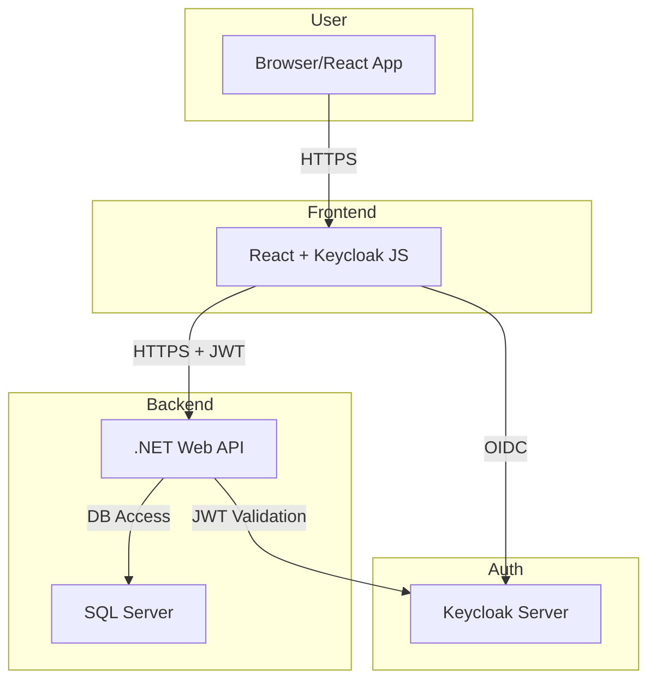
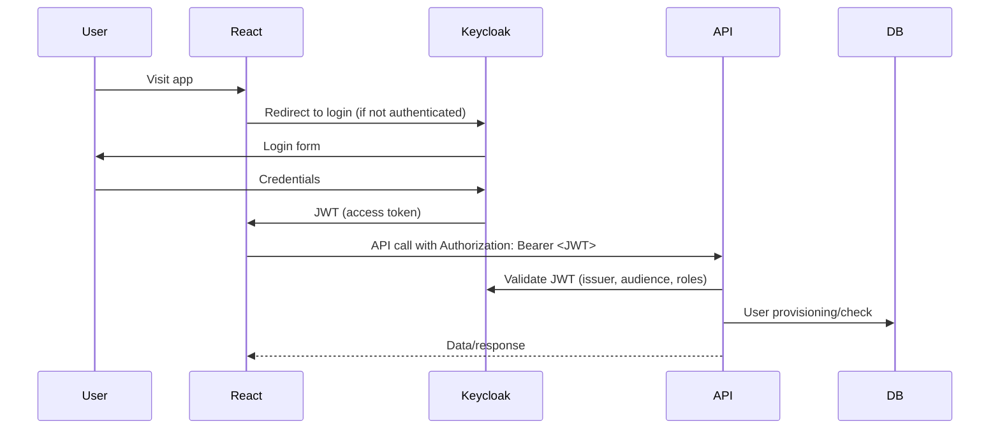
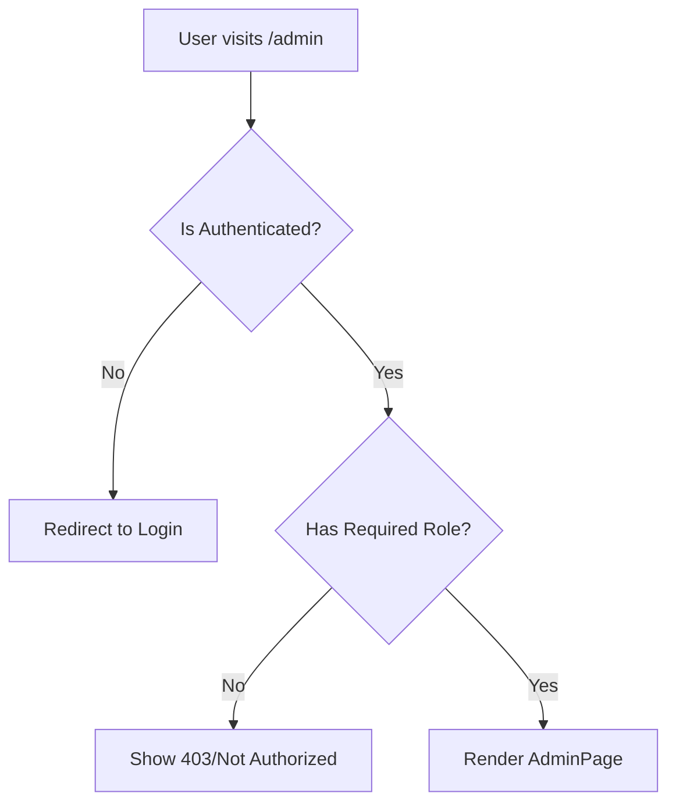
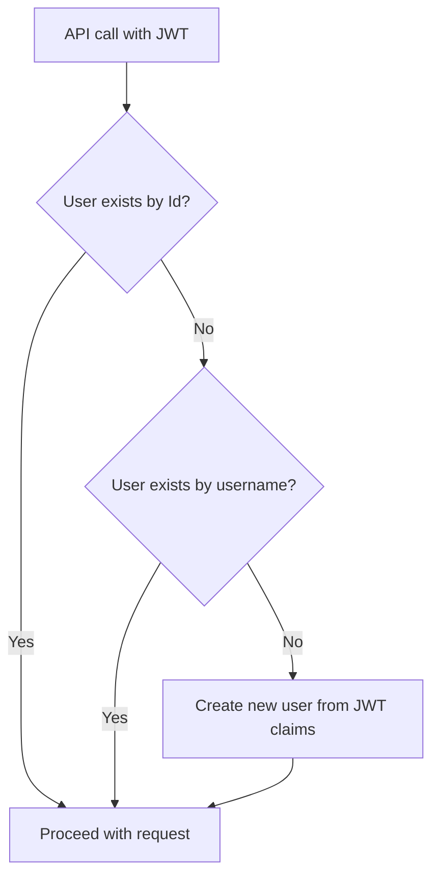
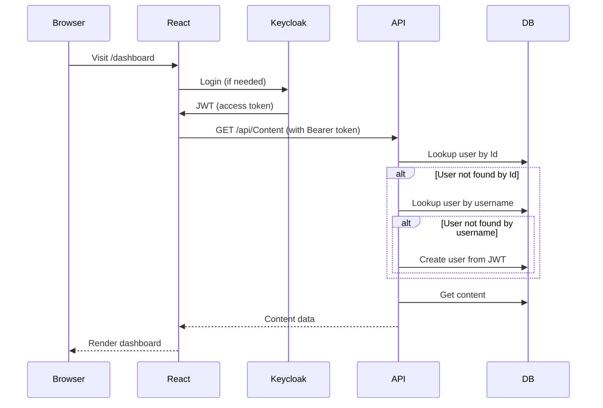

# cae_loginKeyCloak

## System Architecture Overview

This project is a full-stack application with:
- **Frontend:** React (with protected routes, role-based UI, and Keycloak integration)
- **Backend:** ASP.NET Core Web API (with JWT authentication, role-based authorization, and user provisioning)
- **Authentication:** Keycloak (with Entra/AD federation possible)
- **Database:** SQL Server (Entity Framework Core)
- **HTTPS:** Enforced for both frontend and backend in local development

---

## **High-Level Architecture Diagram**



---

## **Key Concepts & Components**

### 1. **Keycloak Integration**
- **Keycloak** is the identity provider (IdP) for authentication and authorization.
- **Frontend:** Uses `@react-keycloak/web` to handle login, logout, and token refresh.
- **Backend:** Validates JWTs from Keycloak, checking `aud`, `iss`, and expiration.
- **Roles:** Managed in Keycloak, mapped to ASP.NET Core roles for `[Authorize(Roles = ...)]`.
- **User provisioning:** On first API call, backend creates a user record if not present, using JWT info.

#### **Keycloak Setup Checklist**
- Create a realm (e.g., `devrealm`).
- Create a client (e.g., `frontend`) with:
  - Access Type: `public`
  - Valid Redirect URIs: `https://localhost:3000/*`
  - Web Origins: `https://localhost:3000`
- Add an **Audience Mapper** to ensure the `aud` claim includes your client.
- Define roles (Admin, Editor, Viewer) at the realm level.
- Assign roles to users.

#### **JWT Flow Diagram**


---

### 2. **HTTPS Everywhere**
- Both frontend and backend run on HTTPS in local development.
- Self-signed certificates are used for local dev (see `.env` and certificate setup instructions).
- The React dev server is configured to use HTTPS and the same cert as the backend.
- This avoids issues with cookies, tokens, and CORS in modern browsers.

#### **HTTPS Troubleshooting**
- If you see browser warnings, trust the local certificate (see `dotnet dev-certs https --trust` or accept in browser).
- Ensure both frontend and backend use the same protocol (all-HTTPS).
- Proxy in `package.json` must match backend protocol.

---

### 3. **Protected Routes & Role-Based Access (Frontend)**
- React uses a `ProtectedRoute` component to guard pages based on authentication and roles.
- The `AuthContext` provides user info, roles, and permissions to all components.
- UI elements and navigation are shown/hidden based on user roles (e.g., Admin, Editor, Viewer).

#### **Protected Route Flow**


---

### 4. **Role-Based Authorization (Backend)**
- ASP.NET Core controllers use `[Authorize(Roles = "...")]` to protect endpoints.
- Keycloak's `realm_access.roles` are mapped to `ClaimTypes.Role` in the backend for compatibility.
- Only users with the correct roles can access protected endpoints (e.g., only Editors/Admins can create documents).

#### **Role Mapping Example**
- Keycloak JWT:
  ```json
  "realm_access": {
    "roles": ["Editor", "default-roles-devrealm"]
  }
  ```
- Backend maps these to `ClaimTypes.Role` so `[Authorize(Roles = "Editor")]` works.

---

### 5. **User Provisioning & Sync**
- On first API call, the backend checks for the user by both Id and username.
- If not found, it creates a new user record using info from the JWT.
- This avoids duplicate users and ensures audit trails are accurate.
- **Always check for existing users by both Id and username before creating a new user.**

---

### 6. **Token Handling & Race Conditions**
- The frontend only makes API calls after the token is set and the user is authenticated.
- The token is set globally in Axios via `setApiAuthToken` in `AuthContext`.
- All API calls include the `Authorization: Bearer ...` header.
- The backend checks token validity, expiration, audience, and issuer.
- **Handle 401 errors gracefully and prompt the user to log in again if needed.**

---

### 7. **CORS & Proxy Setup**
- The backend CORS policy allows requests from the frontend's HTTPS origin.
- The React dev server uses a proxy to forward `/api` requests to the backend, preserving cookies and headers.
- **Proxy Example:**
  ```json
  "proxy": "https://localhost:5001"
  ```

---

## **Entity Relationship Diagram (ERD)**

```mermaid
erDiagram
    User {
        GUID Id PK
        string AdUsername UNIQUE
        string Email
        string DisplayName
        string Role
        bool IsActive
        datetime CreatedAt
        datetime? UpdatedAt
        datetime? LastLogin
    }
    Document {
        GUID Id PK
        string Title
        string Content
        string CreatedBy
        datetime CreatedAt
        string? UpdatedBy
        datetime? UpdatedAt
    }
    Content {
        GUID Id PK
        string Title
        string Body
        bool IsPublished
        string CreatedBy
        datetime CreatedAt
        string? UpdatedBy
        datetime? UpdatedAt
    }
    User ||--o{ Document : creates
    User ||--o{ Content : creates
```

---

## **User Provisioning Flow**



---

## **Code Samples: Common Patterns**

### **Custom Claims Extraction (Backend)**
```csharp
// Extract custom claim from JWT
var customClaim = User.FindFirst("custom_claim")?.Value;
if (!string.IsNullOrEmpty(customClaim))
{
    // Use the claim
}
```

### **Robust Error Handling (Backend)**
```csharp
try
{
    // Some DB or business logic
}
catch (DbUpdateException ex)
{
    _logger.LogError(ex, "Database update failed");
    return StatusCode(500, "A database error occurred. Please try again later.");
}
catch (Exception ex)
{
    _logger.LogError(ex, "Unexpected error");
    return StatusCode(500, "An unexpected error occurred.");
}
```

### **Frontend: Authenticated API Call Hook**
```js
import { useAuth } from '../contexts/AuthContext';
import { useEffect, useState } from 'react';
import api from '../services/api';

export function useProtectedApi(endpoint) {
  const { isAuthenticated, token } = useAuth();
  const [data, setData] = useState(null);
  const [error, setError] = useState(null);
  useEffect(() => {
    if (isAuthenticated && token) {
      api.get(endpoint)
        .then(res => setData(res.data))
        .catch(err => setError(err));
    }
  }, [isAuthenticated, token, endpoint]);
  return { data, error };
}
```

### **Frontend: Role-Based UI Example**
```js
const { hasRole } = useAuth();
return (
  <>
    {hasRole('Admin') && <button>Admin Action</button>}
    {hasRole('Editor') && <button>Edit Content</button>}
  </>
);
```

---

## **Database Table Notes**
- `User.AdUsername` is unique and used for provisioning and audit.
- `Document.CreatedBy` and `Content.CreatedBy` reference the username, not a foreign key, for audit trail simplicity.
- All tables have `CreatedAt` and optional `UpdatedAt` for tracking changes.

---

## **Visual: End-to-End User Provisioning and Access**



---

## **How to Build New Features/Controllers**

### **Controller Template (ASP.NET Core)**
```csharp
[Authorize]
[ApiController]
[Route("api/[controller]")]
public class MyFeatureController : ControllerBase
{
    // Inject repositories/services as needed

    // GET: api/MyFeature
    [HttpGet]
    public async Task<IActionResult> GetAll() { /* ... */ }

    // GET: api/MyFeature/{id}
    [HttpGet("{id}")]
    public async Task<IActionResult> GetById(Guid id) { /* ... */ }

    // POST: api/MyFeature
    [Authorize(Roles = "Editor,Admin")]
    [HttpPost]
    public async Task<IActionResult> Create([FromBody] CreateMyFeatureRequest request) { /* ... */ }

    // PUT: api/MyFeature/{id}
    [Authorize(Roles = "Editor,Admin")]
    [HttpPut("{id}")]
    public async Task<IActionResult> Update(Guid id, [FromBody] UpdateMyFeatureRequest request) { /* ... */ }

    // DELETE: api/MyFeature/{id}
    [Authorize(Roles = "Admin")]
    [HttpDelete("{id}")]
    public async Task<IActionResult> Delete(Guid id) { /* ... */ }
}
```
- **Always check for existing records by all unique fields before creating new ones.**
- **Add logging for all critical actions and errors.**
- **Validate all input and return clear error messages.**

### **Frontend API Usage Template**
```js
// In services/api.js
export const myFeatureAPI = {
  getAll: async () => api.get('/api/MyFeature'),
  getById: async (id) => api.get(`/api/MyFeature/${id}`),
  create: async (data) => api.post('/api/MyFeature', data),
  update: async (id, data) => api.put(`/api/MyFeature/${id}`, data),
  delete: async (id) => api.delete(`/api/MyFeature/${id}`),
};
```
- **Always use the `/api/ControllerName` (PascalCase) format to match backend routes.**
- **Only make API calls after authentication and token are available.**

---

## **Common Pitfalls & How to Avoid Them**

- **Duplicate user creation:** Always check for existing users by both Id and username before creating a new user.
- **Token not set:** Only make API calls after the token is set in Axios (use AuthContext).
- **Case sensitivity:** Use PascalCase for all controller routes and API calls to match ASP.NET Core conventions.
- **CORS/HTTPS issues:** Always use HTTPS for both frontend and backend in local dev, and configure CORS to allow the correct origin.
- **Authorization header missing:** Ensure the token is set globally in Axios before any API call.
- **Race conditions:** Use React hooks to wait for authentication and token before making API calls.
- **Expired tokens:** Handle 401 errors gracefully and prompt the user to log in again if needed.
- **Database constraints:** Validate all required fields and unique constraints before inserting records.
- **Proxy misconfiguration:** Ensure the React dev server proxy matches the backend protocol and port (all-HTTPS or all-HTTP).
- **Keycloak audience/issuer mismatch:** Always check the `aud` and `iss` claims in your JWT and backend config.
- **Frontend/backend protocol mismatch:** Always use all-HTTPS or all-HTTP for local dev to avoid redirect and header loss.

---

## **Fixes & Best Practices from This Project**

- Added audience mapper in Keycloak to ensure correct `aud` claim in JWT.
- Mapped Keycloak roles to ASP.NET Core roles for `[Authorize(Roles = ...)]` to work.
- Centralized token setting in AuthContext to avoid race conditions.
- Used HTTPS for both frontend and backend, with local certificates and `.env` config.
- Checked for existing users by both Id and username before creating new users.
- Added detailed logging for all critical actions and errors.
- Used PascalCase for all controller and API routes for consistency.
- Ensured all API calls use the `/api/ControllerName` format.
- Provided robust error handling and clear error messages for all endpoints.
- Added troubleshooting for HTTPS, CORS, and Keycloak integration.

---

## **How to Set Up Local HTTPS (Recap)**
1. Generate a self-signed cert (e.g., with OpenSSL or mkcert):
   ```bash
   openssl req -x509 -out localhost.pem -keyout localhost-key.pem -newkey rsa:2048 -nodes -sha256 -subj "/CN=localhost" -addext "subjectAltName=DNS:localhost"
   ```
2. Place `localhost.pem` and `localhost-key.pem` in your frontend root.
3. Add to `.env`:
   ```
   HTTPS=true
   SSL_CRT_FILE=./localhost.pem
   SSL_KEY_FILE=./localhost-key.pem
   ```
4. Set `"proxy": "https://localhost:5001"` in `package.json`.
5. Restart both backend and frontend.

---

## **How to Add a New Protected Feature**
1. Add a new controller in the backend using the template above.
2. Add new API methods in `services/api.js` in the frontend.
3. Add new pages/components and use `ProtectedRoute` for role-based access.
4. Add new roles in Keycloak if needed, and assign them to users.
5. Test with different user roles to ensure correct access control.

---

## **Troubleshooting Checklist**
- [ ] Is the token present and valid in the Authorization header?
- [ ] Are all API calls using the correct `/api/ControllerName` format?
- [ ] Are you using HTTPS everywhere in local dev?
- [ ] Is CORS configured to allow your frontend origin?
- [ ] Are you checking for existing records before creating new ones?
- [ ] Are all required fields present in your requests?
- [ ] Are you handling 401/403 errors gracefully in the frontend?
- [ ] Are you logging all critical actions and errors?
- [ ] Are Keycloak and backend audience/issuer settings in sync?
- [ ] Are you using all-HTTPS or all-HTTP for local dev?

---

## **Contact & Contribution**
- For questions, open an issue or pull request on GitHub.
- Contributions are welcome! Please follow the templates and best practices above.
